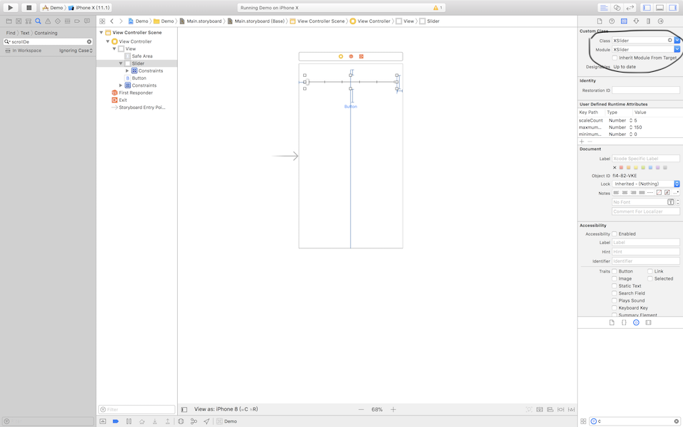
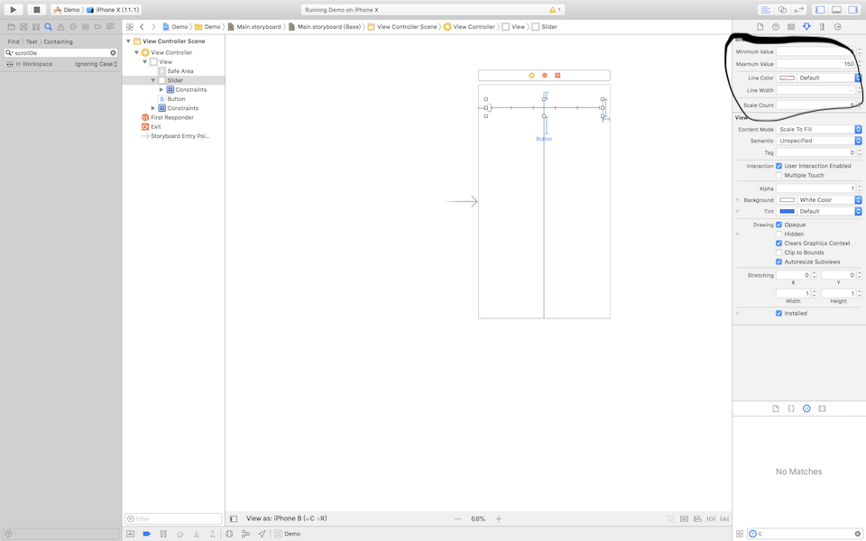

# XSlider
A very simple and IBDesignable Slider, change value by step .

<p align="center">

<a href="https://github.com/Carthage/Carthage"></a>
<a href="https://raw.githubusercontent.com/xmartlabs/Eureka/master/LICENSE"></a>
<a href="https://developer.apple.com/swift"></a>
</p>

<p align="center">

</p>

# Contents
* [Next]
* [Requirements]
* [Support]
* [Properties]
* [Usage]
  + [How to use]
* [Autor]
## Requirements
* Xcode 9+
* Swift 3+
## Support
* ios 10.0 *
## Next Plan
- Add label for every scale and let user choose it show or hide

## Properties
- LineColor
- LineWidth
- ScaleCount
- Maxmum Value
- Minimum Value
- value
<p align="center">

</p>

## Usage
  Use in storeboard or in Your Code like a Apple's UISlider Control.

### Carthage
  Add ``` github "ziyingzhishang/XSlider" "master" ``` in Cartfile of your porject .
### CocoaPod
Add ``` pod 'XSlider' :git=>'https://github.com/ziyingzhishang/XSlider.git' ``` in Podfile of your project .

Use it just like use UISlider , very easy !

### Use in storyboard
+ Drag a UIView to your storyboard and set it to ```XSlider```  type ;
<p align='center'>

</p>

+ Set its properties in right panel of view ;
<p align='center'>

</p>

```swift
import UIKit

class ViewController: UIViewController {
  @IBOutlet weak private var slider: XSlider!

  @IBAction func valueChanged(_ sender: Any) {
    guard let slider = sender as? XSlider else { return }
    print("\(slider.value)======")
  }
}
```

## Autor
- email: ziyingzhishang@163.com
- QQ: 987942684


