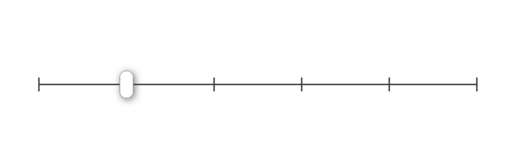
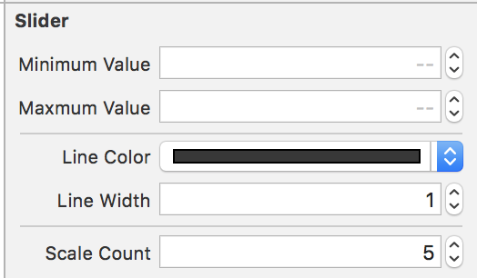

# XSlider
<p align="center">

<a href="https://github.com/Carthage/Carthage"></a>
<a href="https://raw.githubusercontent.com/xmartlabs/Eureka/master/LICENSE"></a>
<a href="https://developer.apple.com/swift"></a>
</p>



# Contents
* [Requirements]
* [Properties]
* [Usage]
  + [How to use]
* [Installation]
* [Donate]
## Plan
- Add label for every scale and let you choose it show or hide
- 
## Requirements
* Xcode 9+
* Swift 3+
## Properties
- LineColor
- LineWidth
- ScaleCount
- Maxmum Value
- Minimum Value
- value



## Usage
  Use in storeboard or in Your Code like a Apple's UISlider Control.
```swift
import UIKit

class ViewController: UIViewController {
  @IBOutlet weak private var slider: XSlider!

  @IBAction func valueChanged(_ sender: Any) {
    guard let slider = sender as? XSlider else { return }
    print("\(slider.value)======")
  }
}
```
## Installation

## Donate


## autor
- email: ziyingzhishang@163.com
- QQ: 987942684


